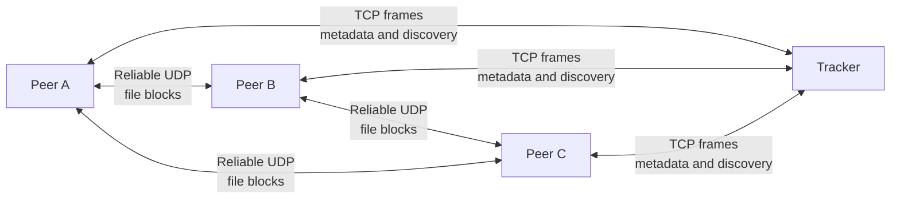

# P2PFS — A Reliable Peer-to-Peer File System in Java

P2PFS is a tracker-coordinated peer-to-peer file system written in Java. It uses TCP for reliable communication with the tracker and a custom reliable UDP protocol for concurrent file-block transfers between peers.

Developed for the Computer Communications course at the University of Minho, the project explores application-level protocols, TCP and UDP sockets, packet reliability, fragmentation, concurrent programming, DNS, and distributed file discovery.

## Features

- Central tracker for peer registration and file discovery
- Direct peer-to-peer file transfer without routing file contents through the tracker
- TCP control plane with a custom binary frame protocol
- Reliable UDP data plane with:
  - acknowledgements
  - automatic retransmission
  - duplicate detection
  - packet fragmentation and reassembly
  - CRC-32 integrity checks
- Concurrent block downloads from multiple peers
- Dynamic peer selection based on availability, usage, and successful transfers
- Block-level availability updates while a download is in progress
- Adaptive file block sizes of up to 256 KiB
- MD5 verification of completed downloads
- Thread-safe tracker and client state
- Forward and reverse DNS support through the included BIND configuration
- Interactive command-line interface for each peer

## Architecture



The tracker stores metadata only: registered peers, available files, and the peers holding each block. File contents move directly between peers over UDP.

### Control plane

Each peer maintains a TCP connection to the tracker. Length-prefixed binary frames carry registration, file publication, discovery, block-location, and disconnection messages.

### Data plane

Peers exchange file blocks directly using UDP. `ReliableRunner` adds acknowledgements, retransmission, duplicate suppression, fragmentation, reassembly, and timeouts on top of the datagram transport.

## Transfer flow

1. A peer connects to the tracker and registers its DNS name and UDP port.
2. The peer scans its shared directory and publishes file metadata.
3. Another peer requests the list of available files or searches by filename.
4. The tracker returns the file metadata and the peers holding each block.
5. The requesting peer downloads blocks concurrently from suitable peers.
6. Every received block is written at its correct offset and reported to the tracker, making the downloading peer a source for that block.
7. The completed file is checked against its MD5 hash.

## Requirements

- JDK 11 or newer
- A network where participating hosts have working forward and reverse DNS records
- TCP port `9090` on the tracker
- UDP port `9090` on each peer

The repository includes example BIND configuration for the `cc2324.local` zone under [`bindconfig/`](bindconfig/). The files define both forward and reverse records for the original laboratory topology.

## Getting started

### 1. Clone the completed branch

```bash
git clone https://github.com/guinucool/p2p-filesystem-um.git
cd p2p-filesystem-um
```

### 2. Compile

The project uses only the Java standard library, so no external dependencies or build tool are required.

```bash
mkdir -p out
javac -d out $(find source -name "*.java")
```

### 3. Configure DNS

The application advertises peers by hostname and resolves them when transferring blocks. Configure forward and reverse DNS for every participating host before starting the system.

Example BIND files are provided in `bindconfig/`:

```text
bindconfig/
├── db.cc2324.local       # Forward zone
├── db.10.cc2324.local    # Reverse zone
├── named.conf.local      # Zone declarations
└── named.conf.options    # Resolver options
```

Adapt the records to your topology and install them using the procedure appropriate for your DNS server.

### 4. Start the tracker

```bash
java -cp out FS_Tracker
```

The tracker listens on TCP port `9090`. Enter the following command in its terminal to stop it:

```text
STOP
```

### 5. Start a peer

```bash
java -cp out FS_Node <shared-directory> <tracker-host>
```

For example:

```bash
java -cp out FS_Node ./shared Servidor1
```

An optional custom tracker port can be supplied as the third argument:

```bash
java -cp out FS_Node <shared-directory> <tracker-host> <tracker-port>
```

The shared directory must already exist. Each peer scans the files in this directory and stores completed downloads there.

## Peer commands

Commands are entered in uppercase.

| Command | Description |
| --- | --- |
| `PATH` | Show the peer's shared-directory path |
| `ADDRESS` | Show the peer's hostname and UDP port |
| `FILES` | List local files and their tracker status |
| `UPDATE` | Rescan the directory and publish its current files |
| `AVAILABLE` | Request and display the files known by the tracker |
| `REQUEST <filename>` | Download a file from the available peers |
| `HELP` | Display the command list |
| `QUIT` | Disconnect cleanly from the tracker |

## Protocol overview

### Tracker protocol over TCP

| Flag | Direction | Purpose |
| ---: | --- | --- |
| `100` | Peer → Tracker | Register peer |
| `101` | Peer → Tracker | Disconnect peer |
| `200` | Peer → Tracker | Publish the peer's file list |
| `201` | Tracker → Peer | Confirm publication and report filename conflicts |
| `202` | Peer → Tracker | Request file metadata |
| `203` | Peer → Tracker | Request sources for a file block |
| `204` | Tracker → Peer | Return file metadata |
| `205` | Tracker → Peer | Return block-source information |
| `300` | Peer → Tracker | Announce a newly acquired block |
| `400` | Peer → Tracker | Request the available-file list |
| `401` | Tracker → Peer | Return the available-file list |
| `0` | Tracker → Peer | Confirm a successful request |

### Transfer protocol over UDP

| Flag | Direction | Purpose |
| ---: | --- | --- |
| `100` | Peer → Peer | Request a file block |
| `200` | Peer → Peer | Return the requested block |

The UDP header also carries the message identifier, query/response state, acknowledgement state, fragmentation state, fragment offset, total size, payload size, and CRC-32 checksum.

## Project structure

```text
.
├── bindconfig/                 # Example BIND forward/reverse DNS configuration
└── source/
    ├── FS_Node.java            # Peer entry point
    ├── FS_Tracker.java         # Tracker entry point
    ├── controller/             # Operations connecting models and views
    ├── file/                   # File metadata, directories, downloads, and blocks
    ├── menu/                   # Interactive peer CLI
    ├── message/                # Binary TCP and UDP message formats
    ├── model/                  # Client, peer, and tracker state
    ├── runner/                 # TCP, UDP, and reliable-UDP transports
    ├── server/                 # Connection and runner servers
    ├── tools/                  # DNS, networking, requests, and timeouts
    ├── view/                   # Tracker and peer data views
    └── worker/                 # Concurrent message and server workers
```

## Technical highlights

### Adaptive block distribution

Files are divided into power-of-two block sizes selected according to file size. A download can keep up to 10 MB of block requests in flight, distributing work across the available peers.

### Progressive sharing

A peer does not need to finish downloading a file before helping distribute it. After receiving a block, it immediately registers itself as a source for that block with the tracker.

### Integrity at two levels

- Every UDP datagram carries a CRC-32 checksum to detect packet corruption.
- Every completed file is checked against its advertised MD5 hash before it is accepted.

### Failure handling

Unanswered UDP requests are retransmitted. Peers that remain unreachable are excluded from subsequent block selection, and their blocks are reassigned to another available source.

## License

No license is currently specified. Unless a license is added, the source code remains protected by standard copyright rules.
